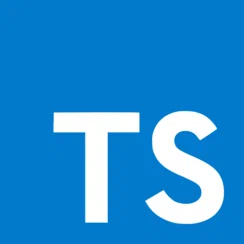

# My TypeScript Journey: Earned Badges 🏆

## Badges Overview

**Here is a collection of badges I earned from completing Microsoft Learn's TypeScript modules**:

- *Getting Started with TypeScript*: [Badge](https://learn.microsoft.com/api/achievements/share/ru-ru/anturchin-2045/FZ93AVCX?sharingId=B5714757CE454825)
- *Declare Variable Types in TypeScript*: [Badge](https://learn.microsoft.com/api/achievements/share/ru-ru/anturchin-2045/K52MWLDB?sharingId=B5714757CE454825)
- *Implement Interfaces in TypeScript*: [Badge](https://learn.microsoft.com/api/achievements/share/ru-ru/anturchin-2045/9NTLP3YU?sharingId=B5714757CE454825)
- *Develop Typed Functions in TypeScript*: [Badge](https://learn.microsoft.com/api/achievements/share/ru-ru/anturchin-2045/UFS96WN3?sharingId=B5714757CE454825)
- *Declare and Instantiate Classes in TypeScript*: [Badge](https://learn.microsoft.com/api/achievements/share/ru-ru/anturchin-2045/X2UXSL9Y?sharingId=B5714757CE454825)
- *Generics in TypeScript*: [Badge](https://learn.microsoft.com/api/achievements/share/ru-ru/anturchin-2045/YVH2BNQR?sharingId=B5714757CE454825)
- *Work with External Libraries in TypeScript*: [Badge](https://learn.microsoft.com/api/achievements/share/ru-ru/anturchin-2045/WACRSLTN?sharingId=B5714757CE454825)
- *Organize Code with Namespaces in TypeScript*: [Badge](https://learn.microsoft.com/api/achievements/share/ru-ru/anturchin-2045/9NSW6RDU?sharingId=B5714757CE454825)
- *Build JavaScript applications using TypeScript*: [Badge](https://learn.microsoft.com/api/achievements/share/ru-ru/anturchin-2045/BLM5492D?sharingId=B5714757CE454825)

---

## Reflections

#### Getting Started with TypeScript
>This module provided a solid foundation for understanding the basics of TypeScript. I learned about the benefits of static typing and how it enhances code quality and maintainability. Getting hands-on experience with setting up TypeScript projects was particularly valuable, as it demystified the initial setup process.

#### Declare Variable Types in TypeScript
>Understanding how to declare variable types in TypeScript was pivotal for me. It not only helped me write more predictable code but also improved my ability to catch errors during development. This module clarified the nuances of TypeScript's type system and how to leverage it effectively in different scenarios.

#### Implement Interfaces in TypeScript
>Interfaces play a crucial role in defining contracts within TypeScript applications. This module delved into the concept of interfaces, showcasing their versatility in ensuring code consistency and facilitating better collaboration within development teams.

#### Develop Typed Functions in TypeScript
>This module deepened my understanding of how to leverage TypeScript's type system when defining functions. By learning to specify parameter and return types, I gained greater confidence in my code's reliability and readability. Additionally, exploring advanced concepts like function overloading expanded my toolkit for crafting flexible and robust functions in TypeScript applications.

#### Declare and Instantiate Classes in TypeScript
>Classes form the backbone of object-oriented programming in TypeScript, and this module provided a comprehensive exploration of their usage. From understanding the principles of object instantiation to implementing inheritance and access modifiers, I acquired essential skills for building scalable and maintainable codebases.

#### Generics in TypeScript
>Generics are a powerful feature of TypeScript that enable writing flexible and reusable code. This module elucidated the concept of generics, illustrating their utility in creating functions, classes, and interfaces that work seamlessly with different data types. By mastering generics, I gained the ability to write more generic and adaptable code.

#### Work with External Libraries in TypeScript
>Leveraging external libraries is integral to modern software development, and this module equipped me with the skills to seamlessly integrate third-party libraries into TypeScript projects. From understanding package management with npm to utilizing type definitions for popular libraries, I learned best practices for incorporating external dependencies while maintaining type safety and code consistency. This knowledge is invaluable for efficiently building and maintaining robust applications within the TypeScript ecosystem.

#### Organize Code with Namespaces in TypeScript
>Effective code organization is essential for managing complexity and facilitating collaboration in large-scale projects. This module introduced namespaces as a mechanism for logically structuring TypeScript code and preventing naming conflicts. By mastering namespace usage, I gained insights into modular development practices and strategies for structuring codebases to enhance maintainability and scalability.

#### Build JavaScript applications using TypeScript
>Transitioning from TypeScript to JavaScript is a common requirement in many projects, and this module provided valuable insights into seamlessly integrating TypeScript into JavaScript applications. From configuring TypeScript compilation to leveraging TypeScript's features while working in a JavaScript environment, I learned practical strategies for maximizing code reuse and minimizing potential compatibility issues. This module underscored the versatility of TypeScript as a tool for enhancing JavaScript development workflows.